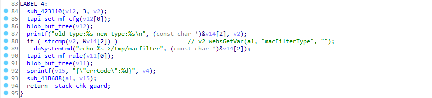
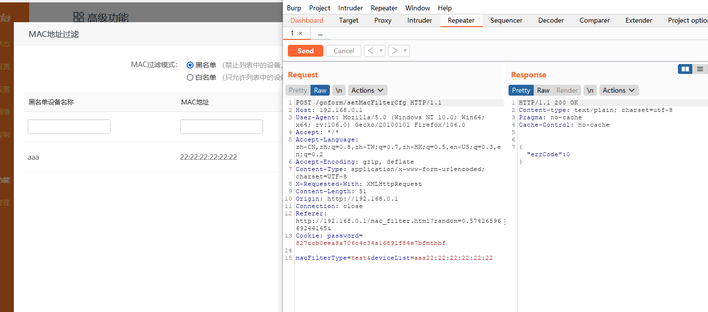
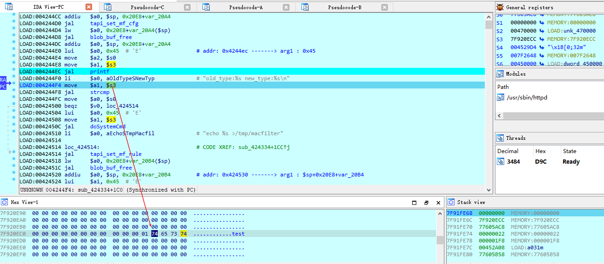
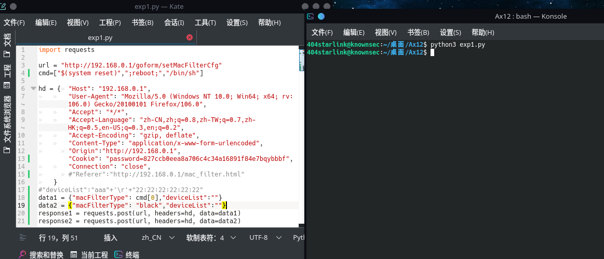
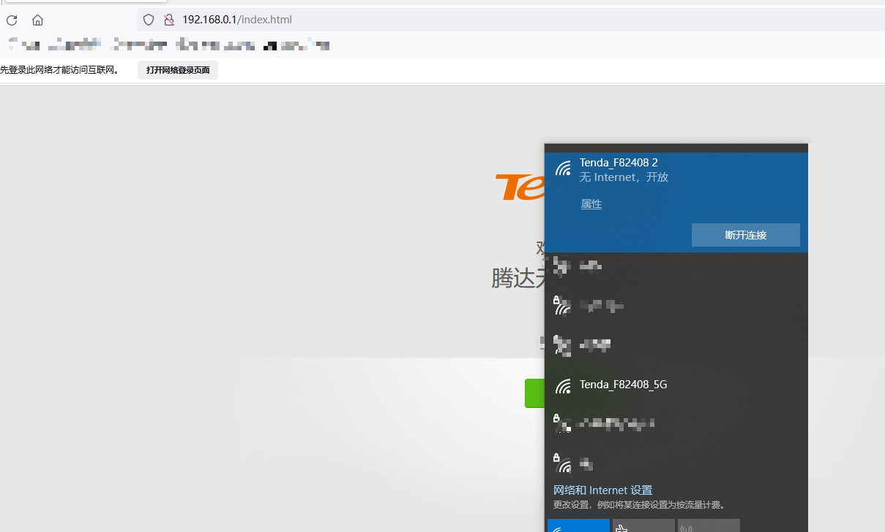
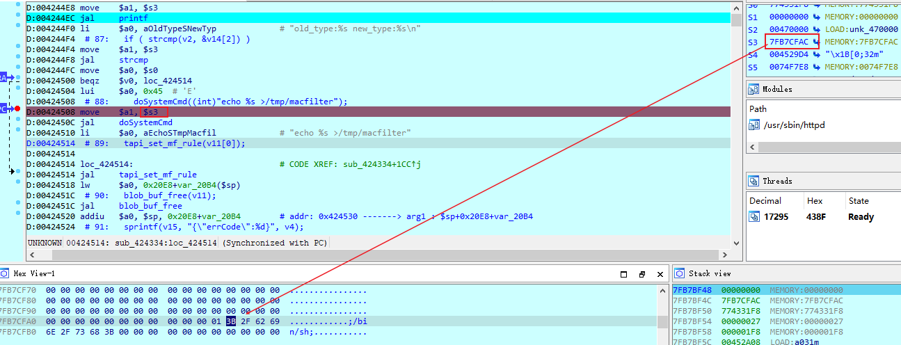

## 漏洞描述 ##
设备：Tenda-AX12 V22.03.01.21_CN([https://www.tenda.com.cn/download/detail-3237.html](https://www.tenda.com.cn/download/detail-3237.html))

漏洞类型：命令注入

攻击效果：代码执行

## 漏洞成因 ##
这个漏洞发生在/goform/setMacFilterCfg接口，其对应的处理函数为sub_424334，本来这是一个存在栈溢出的函数，但是我偶然发现，其可能会存在命令注入。

在这个函数的最下面，有这样的代码。

可以看到，其很危险的调用了doSystemCmd函数，只为了输出一段话到/tmp/macfilter文件，仔细观察后，v2是传入的macFilterType参数，根据printf的那句话，&v14[2]是不是就是指向上一次macFilterType的值呢，如果能控制这个参数，就有可能造成命令注入。

这个接口对应了后台管理界面->高级功能->MAC地址过滤，macFilterType参数就是对应了白名单和黑名单，也就是write和black。先进行一次访问，但是我将macFilterType的值修改为test。

紧接着，继续再正常随便访问一次，发现&v14[2]的值就是test。

这意味着，确实存在命令注入。

## 攻击效果

根据这个我尝试编写脚本进行攻击，主要是重启命令，恢复出厂设置命令，和/bin/sh命令，攻击效果如下。

重启命令和恢复出厂设置，都起了效果，但是/bin/sh却未成功，但是经过调试发现，确实进入dosystemcmd函数前的参数是/bin/sh，但不知道为什么没成功getshell。

无论怎样，这个地方确实存在着命令注入，虽然需要一次身份验证，但是危害性还是较强。

